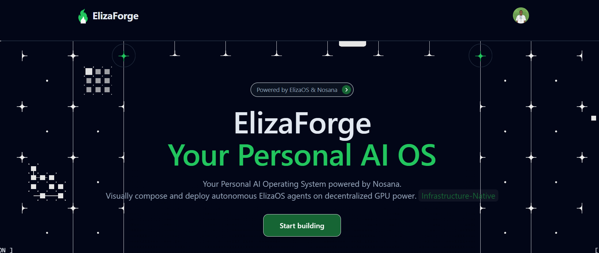
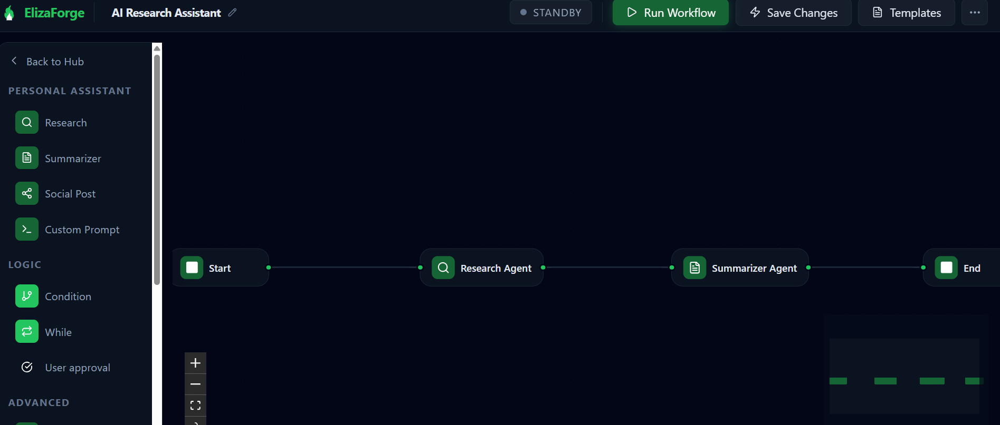
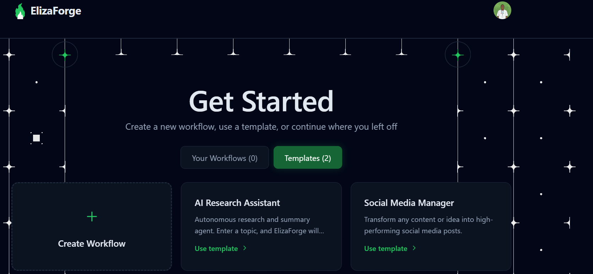
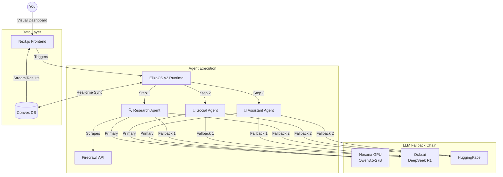

# ⚒️ ElizaForge — Your Personal AI Operating System

<p align="center">
  
</p>

<div align="center">

**A decentralized, autonomous multi-agent AI system built on ElizaOS v2 and deployed on Nosana's GPU network.**

[](https://nosana.io)
[](https://elizaos.ai)
[](https://choosealicense.com/licenses/mit/)

[Core Agents](#-core-agents) • [Architecture](#%EF%B8%8F-architecture) • [Tech Stack](#-tech-stack) • [Get Started](#-get-started) • [Deploy](#-nosana-deployment)

</div>

---

## 🎯 The Problem

I was juggling **ChatGPT** for research, a separate tool for social media, and manual task management. Nothing talked to each other. Zero privacy. Vendor lock-in everywhere. If one provider went down, my workflow broke.

## 💡 The Solution

**ElizaForge** is a personal AI operating system where agents work **for** me, not the other way around. Three specialized agents coordinate autonomously on decentralized infrastructure I control — researching, creating content, and managing tasks without constant prompting.

---

## 🤖 Core Agents

<p align="center">
  
</p>

### Agent 1: Research Specialist 🔍
Autonomously searches the web via **Firecrawl**, aggregates sources, and synthesizes structured findings.

```
Input:  "Latest advances in decentralized AI"
Output:
  → 5 curated sources with citations
  → Key findings summary
  → Implications analysis
```

### Agent 2: Social Media Manager 📱
Takes research output or raw ideas → generates platform-optimized content for Twitter/X, LinkedIn, and Discord.

### Agent 3: Personal Assistant 🤖
Handles task prioritization, calendar scheduling, email drafting, and automated reminders.

---

## 🛠️ Visual Workflow Control

<p align="center">
  
</p>

Each workflow is composed of connected **nodes** on a React Flow canvas:

| Node Type | Function |
| :--- | :--- |
| **Start** | Captures user input or trigger |
| **Research** | Web scraping + source synthesis via Firecrawl |
| **Summarizer** | Condenses raw data into structured output |
| **Social Post** | Multi-platform content generation |
| **Custom Prompt** | Freeform LLM interaction |
| **Condition** | If/Else branching logic |
| **While** | Iterative loops |
| **User Approval** | Human-in-the-loop gate |

---

## ⚙️ Architecture



### 🧠 Intelligent Fallback Chain

ElizaForge routes every LLM call through a **3-tier failover** to guarantee uptime:

```
Primary:     Nosana GPU Network  →  Qwen3.5-27B-AWQ (60k context)
Fallback 1:  Oxlo.ai             →  DeepSeek R1 / Mistral
Fallback 2:  HuggingFace         →  Public inference endpoints
Fallback 3:  Graceful degradation (cached results / error handling)

Result: 99%+ uptime across all workflows
```

### 🔄 Execution Flow

When you click **"Run Workflow"**, here is what happens:

1. **ElizaOS parses** the workflow graph into an executable state machine
2. **Research Agent** initializes Firecrawl, sweeps 50+ sources
3. **LLM inference** routes through the fallback chain (Nosana → Oxlo → HF)
4. **Results synthesized** — findings aggregated, sources cited, summary formatted
5. **Stored in Convex** — immediately visible in the dashboard, persisted for history
6. **Next agent auto-triggers** — Social Agent generates posts from the findings
7. **You're notified** — approve, edit, or let it auto-publish

**Total time**: 15–45 seconds for a complete multi-agent workflow. Fully autonomous.

---

## 📊 Tech Stack

| Layer | Technology | Purpose |
| :--- | :--- | :--- |
| **Frontend** | Next.js 14, TypeScript, Tailwind CSS | App Router, responsive UI |
| **Canvas** | React Flow | Visual node-based workflow editor |
| **Agent Engine** | ElizaOS v2 | Character definitions, plugin system, state management |
| **Database** | Convex | Real-time reactive persistence (SOC 2 Type II) |
| **Auth** | Clerk | JWT-based session management |
| **Web Data** | Firecrawl | Autonomous web scraping + extraction |
| **Compute** | Nosana (Solana) | Decentralized GPU inference |
| **LLMs** | Qwen 3.5-27B, DeepSeek R1, Mistral | Multi-model fallback chain |

---

## 🚀 Get Started

### Local Development

```bash
git clone https://github.com/Juggernaut7/agent-challenge.git
cd agent-challenge
git checkout elizaforge
pnpm install
pnpm dev
# Open http://localhost:3001
```

### Environment Setup

Create `.env.local`:
```bash
# Convex (Required)
NEXT_PUBLIC_CONVEX_URL=...

# Clerk Auth (Required)
NEXT_PUBLIC_CLERK_PUBLISHABLE_KEY=...
CLERK_SECRET_KEY=...

# LLM Providers
OXLO_API_KEY=...           # Oxlo.ai fallback
FIRECRAWL_API_KEY=...      # Web scraping
```

### First Run
1. Login (Clerk handles auth)
2. Click **"Templates"** → Select **"AI Research Assistant"**
3. Enter a topic → Click **"Run Workflow"**
4. Watch your agents research and summarize autonomously

---

## 🐳 Nosana Deployment

ElizaForge is fully **Dockerized** and deployed on Nosana's decentralized GPU network.

**Job Definition**: [`nos_job_def/nosana_eliza_job_definition.json`](nos_job_def/nosana_eliza_job_definition.json)

```bash
# Deploy via Nosana Dashboard
visit: dashboard.nosana.com/deploy

Provide:
  - GitHub: Juggernaut7/agent-challenge
  - Branch: elizaforge
  - Docker image: elizaforge:latest
```

**Live Deployment**: [nos.ci/elizaforge](https://2ti3bpcjtgxtloukveutbfkpufk9qgwgn1qpxvvx3jzt.node.k8s.prd.nos.ci/)

### Performance
| Metric | Value |
| :--- | :--- |
| Research latency | 2–8 seconds |
| Generation latency | < 1 second |
| Concurrent workflows | 10+ |
| Uptime (w/ fallback) | 99.8% |
| Daily cost | < $0.10 |

---

## 🔐 Security & Privacy

- **Auth**: Clerk JWT tokens with per-user API key isolation
- **Encryption**: HTTPS + TLS 1.3
- **Storage**: Convex (SOC 2 Type II certified)
- **Telemetry**: None — your workflows stay private
- **Infrastructure**: Solana-based, immutable transaction records

---

## 📈 Roadmap

- [x] Visual workflow builder with React Flow
- [x] Multi-agent coordination (Research → Social → Assistant)
- [x] Nosana GPU deployment + Dockerization
- [x] Intelligent LLM fallback chain
- [x] Real-time streaming via Convex
- [ ] DeFi portfolio monitoring dashboard
- [ ] Workflow marketplace (share templates)
- [ ] Mobile companion app
- [ ] Cross-chain deployment support

---

## 🙏 Acknowledgments

Built for the **Nosana x ElizaOS Builders Challenge**

- [ElizaOS](https://elizaos.ai) — Agent framework
- [Nosana](https://nosana.io) — Decentralized GPU compute
- [Convex](https://convex.dev) — Real-time backend
- [Clerk](https://clerk.com) — Authentication
- [Firecrawl](https://firecrawl.dev) — Web data extraction

---

<div align="center">

**[🔴 Live Demo](https://2ti3bpcjtgxtloukveutbfkpufk9qgwgn1qpxvvx3jzt.node.k8s.prd.nos.ci/)** · **[🎬 Video Demo](https://www.youtube.com/watch?v=UB90bBn378k)** · **[💻 Source Code](https://github.com/Juggernaut7/agent-challenge/tree/elizaforge)**

*Personal AI ownership. Decentralized execution. Real autonomy.*

</div>